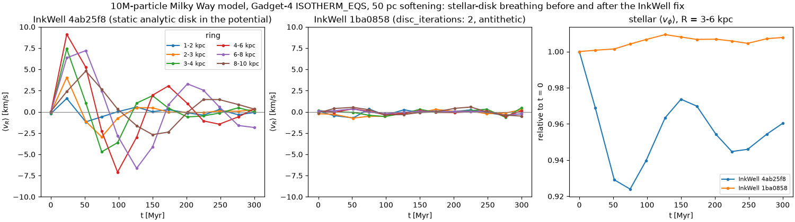

# N-body galaxy simulations on geryon3

Tutorials and a worked example for running galaxy N-body + SPH simulations on the **geryon3**
cluster, end to end:

```
install  →  initial conditions (InkWell)  →  simulation (Gadget4, MPI + Slurm)  →  analysis (pynbody)
```

The first example is an **isolated Milky Way-like galaxy with gas**. It has an NFW dark-matter
halo, an exponential stellar disk, a Hernquist bulge, and an isothermal gas disk: 10M particles,
evolved for 2 Gyr.

## Tutorials

| | |
|---|---|
| [01 — Environment setup](tutorials/01_environment_setup.md) | modules, Python venv, building Agama/InkWell/pynbody and Gadget4 |
| [02 — Initial conditions](tutorials/02_initial_conditions.md) | the galaxy model, InkWell configuration, sanity checks |
| [03 — Running Gadget4](tutorials/03_running_gadget4.md) | Config.sh, parameter file, softening, Slurm, monitoring, restarts |
| [04 — Analysis with pynbody](tutorials/04_analysis_pynbody.md) | loading snapshots, components, maps, rotation curves, profiles, masses vs time |

## Quickstart

```bash
git clone <this repo> && cd run_nbody_sims

# 1. environment (login node; ~10 min)
bash env/install_python_env.sh                # clones codes at pinned commits, builds venv
cd examples/mw_gas
srun -p debug -N1 -n1 -c 32 -t 30 bash build_gadget4.sh

# 2. low-resolution test: 100k particles, 500 Myr (~10 min ICs + ~2 min run)
sbatch --partition=debug run_ics.sbatch inkwell_mw_gas_test.yaml mw_gas_test
sbatch run_gadget4_test.sbatch                 # after the ICs job has finished

# 3. full run: 10M particles, 2 Gyr; ICs and run chained
ICJ=$(sbatch --parsable run_ics.sbatch inkwell_mw_gas.yaml mw_gas)
sbatch --dependency=afterok:$ICJ run_gadget4.sbatch

# 4. analysis
cd ../../notebooks && source ../env/modules.sh
jupyter nbconvert --to notebook --execute mw_gas_analysis.ipynb --output mw_gas_analysis_run.ipynb
```

All large files go to `$NBODY_RUNS` (default `~/nbody_runs`: `builds/`, `ics/`, `runs/`). The
repository holds only configuration, scripts, and documentation.

## Repository layout

```
env/
  modules.sh                  modules + paths; sourced by every script
  versions.env                pinned commits of all codes
  fetch_sources.sh            clone codes from ~/codes at those commits (login node)
  install_python_env.sh       build the venv (Agama, InkWell, pynbody, Jupyter)
  requirements.txt            pinned third-party Python packages
  patches/                    Agama build fix for the static-libpython Python module
examples/mw_gas/
  inkwell_mw_gas.yaml         ICs, 10M particles
  inkwell_mw_gas_test.yaml    ICs, 100k particles (same model)
  make_ics.py                 generate ICs once, write Gadget-4 + InkWell formats
  check_ics.py                IC/snapshot sanity checks (masses, v_c, Q, dispersions)
  check_inkwell_ic.py         InkWell file checks: units, pynbody, u convention, recentring
  relax_diag.py               per-snapshot thickness, centring, Σ, R_d, A2 for relaxation studies
  param_relax.txt             Gadget4 parameters for the 300 Myr relaxation test
  Config.sh                   Gadget4 compile-time options
  param.txt, param_test.txt   Gadget4 runtime parameters
  build_gadget4.sh            out-of-tree Gadget4 build
  run_ics.sbatch              Slurm: InkWell on a compute node
  run_gadget4*.sbatch         Slurm: Gadget4 (restart-aware; test, full and relaxation runs)
notebooks/
  mw_gas_analysis.ipynb       analysis notebook
  mwtools.py                  loading helpers (time, components, centring)
  config.ini                  pynbody particle-type mapping for these runs
tutorials/                    the four tutorials
```

## Software versions (verified 2026-10-02)

| Component | Version |
|---|---|
| Modules | `openmpi/4.1.5/gnu`, `gsl-1.16`, `hdf5/1.14.3/serial/gnu`, `python-3.11.4` (GCC 8.5.0) |
| Gadget4 | `6fb393b5` |
| InkWell | `1ba08586` (the 2 Gyr run below used `8c765a68`; see note) |
| Agama | `60d8d8b8` + `env/patches/agama_static_libpython.patch` (1.0.160) |
| pynbody | `2c9e0a33` (2.8.0 dev) |
| Python packages | numpy 2.4.6, scipy 1.17.1, h5py 3.16.0, pytreegrav 1.4.0, matplotlib 3.11.2 |

## The Milky Way example in numbers

| Component | Mass [Msun] | Particles | Softening |
|---|---|---|---|
| DM halo (NFW, c = 10, M_vir = 1e12, tapered at r_vir) | 8.1e11 live | 6,000,000 | 0.15 kpc |
| Stellar disk (R_d = 3 kpc, z0 = 0.3 kpc, Q = 2) | 4.5e10 | 3,000,000 | 0.05 kpc |
| Bulge (Hernquist, a = 0.63 kpc) | 1.0e10 | 666,668 | 0.05 kpc |
| Gas disk (R_g = 6 kpc, isothermal 10⁴ K) | 5.0e9 | 333,333 | 0.05 kpc |

The 10M ICs (InkWell `1ba0858`) give v_c(8 kpc) = 215 km/s, a rotation curve flat to within 7%
between 5 and 20 kpc, and Toomre Q(2R_d) = 1.9. InkWell's disk-equilibrium check passes, with the
realised/model disk ratio 0.99–1.00 at all radii.

### Test run (100k particles, 500 Myr, InkWell `1ba0858`)

| | |
|---|---|
| Cost | ICs 16 min; Gadget4 1 min 16 s on 64 cores (debug partition) |
| Energy drift | −6.0×10⁻⁴ |
| Bar | none; a noise-seeded transient spiral reaches A₂ = 0.105 at ~320 Myr and decays |
| Disk | stays within 0.05 kpc of the halo centre; 13% thickening at 8 kpc, as expected at this resolution |

### Full run (10M particles, 2 Gyr)

> This run was made with InkWell `8c765a6`, before the fixes that came out of our compatibility
> reports. Two differences from the current `1ba0858` matter. First, its stellar disk was not in
> equilibrium in the N-body potential, so the "initial relaxation" row below is an artifact that
> the current InkWell removes (see "Relaxation tests"). Second, its halo was not sampled in
> mirrored pairs, so the disk drifted slowly (0.38 kpc vertically by 2 Gyr). The model and
> resolution are otherwise the same.

| | |
|---|---|
| Resources | 2 nodes × 64 MPI ranks (`batch`), `MaxMemSize` 6000 MB |
| Cost | ICs 9 min 31 s on 1 node; Gadget4 **7 h 44 min** on 128 cores (~990 core-hours) |
| Output | 11 snapshots × 0.36 GB = 4.0 GB, plus 2.7 GB of restart files (deletable once the run is final) |
| Energy drift | 4.9×10⁻⁴ over 2 Gyr; mass of every particle type exactly conserved |
| Bar | none: A₂ (R < 6 kpc) ≤ 0.007 throughout |
| Disk heating | stellar z_rms at 7–9 kpc 0.535 → 0.542 kpc (+1.3%) |
| Initial relaxation | in the first 200 Myr, inner stellar Σ (2–4 kpc) drops ~9% and the fitted R_d grows ~6%; the gas disk settles ~7% thinner. Everything is then steady from 0.2 to 2 Gyr |
| Gas | develops flocculent multi-arm spirals; transient ring features in Σ_gas around 0.4 Gyr dissolve by 1 Gyr |


The snapshot cadence was set to 200 Myr to keep this first run to ~4 GB. For 50 Myr cadence
(~15 GB), set `TimeBetSnapshot 0.0511352` in `param.txt`. The mass-versus-time analysis uses
`energy.txt`, so it keeps 5 Myr resolution either way.

### Relaxation tests (10M particles, 300 Myr, a snapshot every 25 Myr)

These test the equilibrium of the initial conditions. The model and setup are the same as the
full run; only the InkWell version differs.

| First 300 Myr | InkWell `4ab25f8` | InkWell `1ba0858` (current) |
|---|---|---|
| stellar ⟨v_R⟩ in rings, max | 9 km/s (coherent radial breathing) | 0.7 km/s |
| inner Σ (2–4 kpc) | −13.6% dip, settles −7.6% | ≤ 1.4% |
| fitted R_d | +13% peak, settles +6% | ≤ 1.2% |
| gas z_rms (4–10 kpc) | −7% | ±3% |
| disk–halo centre separation, max | 0.060 kpc | 0.004 kpc |
| energy drift | 0.9×10⁻⁴ | 1.0×10⁻⁴ |
| cost | 1 h 24 min on 128 cores, 5.1 GB | 1 h 22 min on 128 cores, 5.1 GB |



Details: `reports/inkwell_gadget4_retest2.md`. Run it with
`sbatch run_gadget4_relax.sbatch $NBODY_RUNS/ics/<name> <run_name>`.
