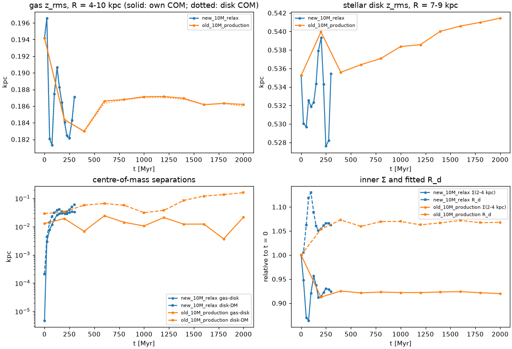

# InkWell → Gadget-4: re-test of `main` @ 4ab25f8

**In reply to:** `inkwell_gadget4_response.md` (InkWell `main` @ `4ab25f8`)
**Tested:** 2026-10-06 on the geryon3 cluster
**Versions:** InkWell `4ab25f8`, Gadget-4 `6fb393b`, Agama 1.0.160 (`60d8d8b`), pynbody 2.8.0 (`2c9e0a33`)
**Prepared for:** Jason Hunt (InkWell developer)

Thank you for the quick turnaround. We re-tested every change on the same Milky Way-like model as
the first report. That model has:

* an NFW halo with M_vir = 1e12;
* a stellar disk of 4.5e10;
* a bulge of 1e10;
* an isothermal gas disk of 5e9 at 10⁴ K.

The model was tested at 100k and 10M particles. The fixes work, with one exception:
**`forceDeriv` is still called on Agama 1.0.160**. The cause and a one-line fix are below.

## Summary

| # | Item | Result |
|---|---|---|
| 1 | Unit metadata | ✅ Fixed. pynbody 2.8 reads mass/length/velocity/u with factors 1.0003/1.0000/1.0000/1.0000, with and without our family mapping (request 1). |
| 2 | `--gadget-eos isothermal` | ✅ Works in `inkwell` and `inkwell-merge`. u_iso / u_adiabatic = 0.666667 for every gas particle, and u = 137.65 (km/s)² = c_s² at 10⁴ K, μ = 0.6. A 500 Myr `ISOTHERM_EQS` run reproduces our converted-u run (energy drift 1.5×10⁻⁴ vs 1.8×10⁻⁴). |
| 3 | `baryon_fraction` | ✅ `0.0` decouples the halo from `omega_b`: the live halo is 8.15e11 with Planck Ω_b, and the log line matches the file. `1.0` and `-0.1` are rejected with a clear error. |
| 4 | `NTYPES=6` docs | ✅ No change needed on our side. |
| 5 | μ docs | ✅ Request 3 is answered below with Gadget-4 data. |
| 6 | Deprecated `forceDeriv` | ❌ **Still triggered** with Agama 1.0.160 (`agama_model.py:225`). Cause and fix below. |
| 7 | Gadget-4 listed as a target | ✅ |
| — | Recentring (`8276263`) | ✅ Every component's centre of mass and bulk velocity is zero to 10⁻¹⁵. It removes the initial offsets but not the later wander, which comes from the halo's density cusp (see below). |
| — | Your consistency tests | ✅ `check jeans` and `check agama` both pass. |
| — | Gadget-4 reading | ✅ The isothermal, adiabatic, and `COOLING`+`STARFORMATION` builds all start from the new files. The SF build reads `StellarFormationTime` and `Metallicity` exactly. |

## Details

### 1. Units with pynbody 2.8 (request 1)

We checked the variants with `examples/mw_gas/check_inkwell_ic.py`:

* default u;
* `--gadget-eos isothermal`;
* `baryon_fraction: 0` with Planck Ω_b;
* the 10M IC;
* a merged file.

All of them have:

* the `Parameters` group with the five unit and cosmology attributes;
* header `HubbleParam = 1`, `Omega0 = OmegaLambda = 0`;
* `InkWell*` provenance;
* per-dataset `a_scaling`, `h_scaling`, `length_scaling`, `mass_scaling`, `velocity_scaling` and
  `to_cgs` attributes.

pynbody 2.8 loads them with factors of 1 (the mass residual of 3×10⁻⁴ is the Msun constant). We
checked under pynbody's default family mapping and under our `config.ini`, which puts
PartType2/3 in `star`. The per-dataset scaling attributes cause no extra a/h factors in 2.x.

Minor: files written by `inkwell-merge` carry only `InkWellInternalEnergy` as provenance; the
`InkWellOmega0` / `InkWellHubbleParam` / `InkWellFormationRedshift` attributes are missing.

### 6. `forceDeriv` is still called with Agama 1.0.160 (request 4)

Every InkWell run logs:

```
inkwell/agama_model.py:225: FutureWarning: forceDeriv is deprecated, use Potential.eval(..., der=True) instead
```

In Agama 1.0.160, `Potential.eval(xyz, der=True)` returns **only** the derivatives, as a single
(N, 6) array. `_force_deriv` finds no `(force, deriv)` pair in that result and falls back to
`forceDeriv`.

Requesting the acceleration as well returns the tuple:

```python
res = pot.eval(xyz, acc=True, der=True)    # -> (acc (N,3), deriv (N,6))
```

We checked on a Plummer + disk potential that this matches `forceDeriv` to machine precision for
both arrays and raises no warning. Changing the call in `_force_deriv` to
`pot.eval(xyz, acc=True, der=True)` should fix 1.0.160 and keep your fallback for older builds.
This is the only warning InkWell or Agama emits in our runs, including `check agama`.

### Recentring and the gas contraction (request 2)

**Our earlier numbers were not measured about the origin.** The z_rms values in the first report
were measured about the stellar-disk centre of mass. We re-analysed the old 100k runs about each
component's own centre (`examples/mw_gas/relax_diag.py`).

The early gas contraction is **real thinning, not disk motion**:

| 100k run (old ICs) | t = 0 | 23–25 Myr | 100 Myr | 200 Myr |
|---|---|---|---|---|
| gas z_rms about the gas COM (R = 4–10 kpc), `ISOTHERM_EQS`, u = c_s² | 0.187 | 0.107 | 0.182 | 0.193 |
| same, u not converted (1.5× pressure) | 0.187 | 0.128 | 0.199 | 0.210 |
| same, adiabatic SPH | 0.187 | 0.103 | 0.192 | 0.221 |
| gas–disk COM separation [kpc] | 0.16 | 0.13 | 0.06 | 0.13 |

The values about the gas COM and about the disk COM agree to ~0.01 kpc. The collapse in the first
25 Myr is nearly the same for all three equations of state, including 1.5× the pressure, so it is
not set by the gas pressure. The most likely cause is resolution. At 100k particles the SPH
smoothing lengths (~0.6 kpc) are larger than the gas disk's thickness. Gadget-4 then underestimates
the midplane density, and so the midplane pressure, and the gas falls toward the midplane until it
is resolved. The 10M run below confirms this: there is no collapse at full resolution.

**Recentring removes the initial offsets but not the later wander.** The new 100k ICs are the old
samples, with each component rigidly shifted to put its centre of mass at the origin (spread of the
shifts < 10⁻¹³ kpc). At t = 0 they start with component separations of ~10⁻⁶ kpc instead of
0.16–0.19 kpc. In the 500 Myr run, however:

| 100k, 500 Myr | old ICs | recentred ICs |
|---|---|---|
| disk–DM COM separation at 200 / 500 Myr | 0.37 / 0.35 kpc | 0.37 / 0.36 kpc |
| gas–disk COM separation at 200 Myr | 0.13 kpc | 0.47 kpc |
| disk COM vertical drift at 200 / 500 Myr | −0.20 / −0.19 kpc | −0.17 / −0.15 kpc |
| z_rms, Σ(R), fitted R_d, A₂, energy drift | — | identical to the old run within noise |

The reason is that the halo's **mass** centre is not its **density** centre. The mass-weighted mean
of 60k NFW particles out to r_vir is dominated by particles at hundreds of kpc, with noise
~r_rms/√N ≈ 0.2–0.4 kpc. The cusp, found by shrinking spheres, is 0.26 kpc from the origin in the
old IC and 0.16 kpc in the new one. Recentring the mass centre neither moves the cusp onto the disk
centre nor makes it worse, and the disk then oscillates about the cusp.

A suggestion: sample the spheroids **antithetically**, adding (−x, −v) for every particle (x, v).
This makes the centre of mass, the bulk velocity, and every odd multipole, including the dipole
that offsets the cusp, exactly zero. It costs nothing, preserves the DF, and is standard for
isolated N-body ICs. Recentring the halo on its shrinking-sphere centre would be a weaker
alternative.

### 3. μ for `COOLING` runs (request 3)

Gadget-4's cooling assumes no initial ionisation state. It solves for the electron abundance
n_e/n_H consistent with u and ρ, in collisional and photo-ionisation equilibrium with the UV
background from `TREECOOL` (`src/cooling_sfr/cooling.cc`). From our `COOLING`+`STARFORMATION`
test (old ICs, u from μ = 0.6 at 10⁴ K), using the `ElectronAbundance` written in the snapshots:

| Time | n_e/n_H (median) | μ | T (median) |
|---|---|---|---|
| t = 0 | 0.34 | 0.93 | 1.5×10⁴ K |
| 100 Myr | 0.003 | 1.22 | 1.0×10⁴ K |
| 200 Myr | 0.002 | 1.22 | 1.0×10⁴ K |

Gadget-4 therefore reads InkWell's 10⁴ K gas as partly ionised 1.5×10⁴ K gas, which cools and
recombines to nearly neutral 10⁴ K gas within 100 Myr.

We would prefer **option (a)**: a per-disk `mean_molecular_weight` that also enters InkWell's
hydrostatic solve. With μ ≈ 1.22 for disks at T ≲ 10⁴ K, the initial u matches what Gadget-4's
cooling settles to, and the vertical structure is self-consistent. Option (b) would leave
InkWell's hydrostatic profile built with a pressure the gas does not have in Gadget-4. We can test
an implementation when you have one.

### Gadget-4 runs on the new ICs

| Run | Result |
|---|---|
| 100k, `ISOTHERM_EQS`, `--gadget-eos isothermal`, 500 Myr | Energy drift 1.5×10⁻⁴. A₂ ≤ 0.05. z_rms, Σ(R), and R_d match the old converted-u run at every snapshot within noise. |
| 100k, adiabatic SPH, default u, 20 Myr | Starts and runs normally. |
| 100k, `COOLING`+`STARFORMATION`, default u, 20 Myr | Starts. `StellarFormationTime` (disk, bulge) and `Metallicity` (gas, disk, bulge) in snapshot 0 equal the IC values particle by particle. |
| 10M, `ISOTHERM_EQS`, `--gadget-eos isothermal`, 300 Myr, a snapshot every 25 Myr | Energy drift 9×10⁻⁵, A₂ < 0.003. Details in the next section. |

### High-resolution relaxation run (10M particles, 50 pc softening) (request 2)

The setup:

* the 10M-particle model, generated with `--gadget-eos isothermal` and recentred;
* `ISOTHERM_EQS`, softening 50 pc for baryons and 150 pc for DM;
* 300 Myr, with a snapshot every 25 Myr;
* 1 h 24 min on 128 cores.

The run conserved energy to 9×10⁻⁵, conserved mass exactly, and had A₂ < 0.003 throughout. The
figure also shows the snapshots of our earlier 2 Gyr production run (old ICs, every 200 Myr).



**Gas: no collapse at full resolution.** Gas z_rms at R = 4–10 kpc, about the gas COM:

| t [Myr] | 0 | 23 | 52 | 75 | 98 | 127 | 202 | 300 | 2 Gyr run, 0.4–2 Gyr |
|---|---|---|---|---|---|---|---|---|---|
| z_rms [kpc] | 0.194 | 0.197 | 0.182 | 0.181 | 0.188 | 0.191 | 0.184 | 0.187 | 0.183–0.187 |

The 100k collapse (−43% in 25 Myr) does not occur. There is a ≤7% oscillation that follows the
stellar breathing described next, and it damps by ~200 Myr. **InkWell's hydrostatic gas profile is
close to equilibrium in Gadget-4 SPH once the gas disk is resolved**, and the 100k behaviour was
numerical.

**Stars: a damped radial breathing oscillation in the first ~200 Myr.** It survives recentring
and is the same in both 10M runs. Its effects:

* inner Σ (2–4 kpc) dips 13% at 50–75 Myr, overshoots back to −4% at 125 Myr, and settles 8%
  below its initial value;
* Σ at 7–9 kpc does the opposite, peaking at +18%;
* the fitted scale length peaks at +13% at 100 Myr and settles at +6%;
* the stellar disk thickness changes by < 2%, so the mode is radial.

After ~200 Myr everything is constant to 2 Gyr.

The stellar disk's mean radial velocity in rings shows the mode directly:

| t [Myr] | ⟨v_R⟩ 2–3 kpc | 3–4 | 4–6 | 6–8 | ⟨v_φ⟩ 3–6 kpc | σ_R 3–6 kpc |
|---|---|---|---|---|---|---|
| 0 | −0.1 | −0.1 | −0.0 | −0.0 | 163.2 | 73.6 |
| 23 | +4.0 | +7.4 | +9.1 | +6.4 | 158.2 | 73.4 |
| 52 | −1.1 | +1.1 | +5.2 | +7.2 | 151.7 | 70.1 |
| 75 | −3.0 | −4.7 | −2.3 | +2.5 | 150.8 | 69.9 |
| 98 | −0.8 | −3.6 | −7.1 | −2.8 | 153.4 | 71.0 |
| 127 | +0.5 | +1.0 | −3.0 | −6.6 | 157.2 | 72.5 |

The ICs have no net radial motion. The stars at 2–8 kpc nevertheless start with slightly more
rotational and radial support than the N-body potential balances: they expand coherently at up to
9 km/s, ⟨v_φ⟩ falls by 7%, and the disk oscillates about a state with ~4% lower ⟨v_φ⟩ at 3–6 kpc.
The ~125 Myr period is close to the epicyclic period at R ≈ 4–6 kpc.

Our hypothesis, which we have not tested: the disk DF is calibrated in a potential containing the
*target* exponential disk (CylSpline), while the N-body system contains the DF's own realised disk,
because the discs are not iterated through the self-consistent model. The two differ slightly.

Two tests that would separate the causes:

1. Compare v_c(R) of the Agama potential used for calibration with v_c(R) of the final particle
   set. We measure 210–211 km/s at 8 kpc from the particles.
2. Integrate the sampled disk orbits in that same Agama potential for ~150 Myr, without N-body.
   If ⟨v_R⟩ still swings by several km/s, the DF and its potential are inconsistent. If not, the
   difference is between the Agama potential and the particle realisation.

The effect is modest and settles in 200 Myr, so users can simply discard the first ~200 Myr. It is
still worth fixing, because a breathing disk at t = 0 complicates studies of early evolution, such
as satellite impacts or bar onset.

## One correction to our first report

The first report quoted v_c(8 kpc) = 214 km/s for the 100k test IC and 206 km/s with the default
baryon fraction. Our checker averaged the circular velocity over only 8 azimuths, which at 100k
particles carries ±4% noise from the lumpy halo. With 64 azimuths the values are 210 and 204 km/s.
The comparison and the conclusions are unchanged.

## Reproducing

All scripts are in the `run_nbody_sims` repository, `examples/mw_gas/`:

* `check_inkwell_ic.py` — file checks;
* `check_ics.py` — physics checks;
* `relax_diag.py` — relaxation diagnostics;
* `param_relax.txt` and `run_gadget4_relax.sbatch` — the 10M run.

The model is `inkwell_mw_gas{,_test}.yaml`, now with `halo.baryon_fraction: 0.0` and Planck Ω_b.
