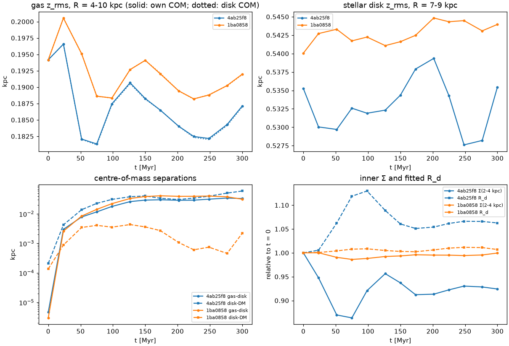

# InkWell → Gadget-4: second re-test, `main` @ 1ba0858

**In reply to:** `inkwell_gadget4_response2.md` (InkWell `main` @ `3e5907e`)
**Tested:** 2026-10-08 on the geryon3 cluster
**Versions:**
* InkWell `1ba0858`: `main` as pulled, which contains `3e5907e`, the `subhalos` merge and the
  two YAML-number fixes;
* Gadget-4 `6fb393b`;
* Agama 1.0.160 (`60d8d8b`);
* pynbody 2.8.0 (`2c9e0a33`).

**Prepared for:** Jason Hunt (InkWell developer)

Thank you. Everything in your response checks out on our side, and the disc iterations fix the
mismatch behind the breathing mode in our model. The details follow, in the order of your four
requests, then the remaining items.

## Summary

| Item | Result |
|---|---|
| Request 1: `forceDeriv` on Agama 1.0.160 | ✅ Gone. No warnings of any kind in any InkWell log. |
| Request 2: 10M relaxation re-run | ✅ **The breathing mode is gone.** \|⟨v_R⟩\| ≤ 0.7 km/s in every ring at every snapshot (it was up to 9 km/s). The inner Σ changes by ≤ 1.4% (it dipped 13%), and the fitted R_d by ≤ 1.2% (it grew 13%). |
| Request 3: `check_disc_equilibrium.py` on the 10M model | ✅ `CylSpline (discs)` ratio 0.992–1.004 at every radius from 0.5 to 20 kpc; `Multipole` ratio 0.995–1.003. |
| Request 4: `mean_molecular_weight: 1.22` with `COOLING` | ✅ No transient. Gadget-4 reads T = 9,990 K, μ = 1.218 at t = 0, and u stays at 102–106 (km/s)² instead of falling from 206 to 105. |
| Merge provenance | ✅ All four `InkWell*` cosmology attributes are carried into merged files. |
| Antithetic sampling | ✅ Pairs are exact to 10⁻¹⁴ kpc and km/s for the halo and bulge. In N-body at 100k the disk stays within 0.05 kpc of the halo centre (previously it drifted 0.44 kpc). |
| Your regression suites | ✅ `check jeans`, `check agama` and `check subhalos` all pass. |

## Request 3: disc equilibrium of our model

We ran your script on our Milky Way model at 100k particles, with and without the new disc
iterations, and on the 10M model. A ratio of 1.00 means the realised disk matches the disk in the
potential.

| R [kpc] | 100k, `disc_iterations: 0` | 100k, default (2) | 10M, default (2) |
|---|---|---|---|
| 0.5 | 1.612 | 1.041 | 0.992 |
| 1.0 | 1.224 | 1.010 | 0.994 |
| 1.5 | 1.079 | 0.994 | 1.001 |
| 2.0 | 0.998 | 0.986 | 1.000 |
| 3.0 | 0.930 | 1.000 | 1.004 |
| 4.0 | 0.925 | 0.988 | 1.001 |
| 5.0 | 0.948 | 0.989 | 1.003 |
| 6.0 | 0.961 | 1.006 | 1.002 |
| 8.0 | 0.972 | 1.008 | 1.001 |
| 10.0 | 0.996 | 1.008 | 0.998 |
| 15.0 | 1.003 | 1.002 | 0.999 |
| 20.0 | 1.007 | 1.007 | 1.000 |

The 100k columns use 0.2 kpc softening and the 10M column uses 0.05 kpc; see the note on
softening below.

Without the iterations our disk shows your diagnosis more strongly than your model did: a 7–8%
deficit at 3–4 kpc, which is where our 10M disk expanded outward and breathed. With the iterations
the 10M model is within ±0.01 everywhere.

Test 2 in the 10M model integrates 20,000 disk orbits for 300 Myr in the Agama potential. It
shows no coherent ⟨v_R⟩ in any ring (|⟨v_R⟩| ≤ 3 km/s at 2–14 kpc, ≤ 4.4 km/s at 1–2 kpc),
⟨v_φ⟩(3–6 kpc) of 166–168 km/s throughout, and ring masses within ±4% (±6% at 1–2 kpc).

**A note on the script's softening.** At 100k particles with the default 50 pc softening, Test 1
is dominated by single particles near the evaluation ring for sparse components. Our gas disk
(3,333 particles) contributes exactly 0.0 km/s at 15 kpc, while it contributes ~36 km/s at 12 and
20 kpc, which made the `CylSpline` ratio 0.957 there. With 0.2 kpc softening the same model gives
1.002. A default softening that scales with N, or a warning for small samples, would avoid that.

## Request 4: μ for `COOLING` runs

`mean_molecular_weight: 1.22` on our isothermal gas disk does what you describe:

* The gas u is 101.55 (km/s)², equal to the μ = 0.6 value × 0.6/1.22 to all printed digits.
* The disk is thinner, as expected from the lower pressure: z_rms at R = 4–10 kpc is 0.128 kpc,
  against 0.187 kpc for μ = 0.6.
* `used_params.yaml` records the key.

We ran Gadget-4 `COOLING`+`STARFORMATION` on it at 100k particles for 200 Myr. The medians are
derived from `ElectronAbundance`:

| t [Myr] | μ = 0.6 (old) n_e/n_H, μ, T, u | `mean_molecular_weight: 1.22` n_e/n_H, μ, T, u |
|---|---|---|
| 0 | 0.341, 0.927, 15,500 K, 206.5 | 0.001, 1.218, 9,990 K, 101.5 |
| 25 | 0.004, 1.215, 10,700 K, 109.6 | 0.002, 1.218, 10,200 K, 104.0 |
| 100 | 0.003, 1.216, 10,500 K, 108.1 | 0.003, 1.217, 10,400 K, 106.5 |
| 200 | 0.002, 1.217, 10,300 K, 104.7 | 0.002, 1.218, 10,200 K, 103.6 |

The thermal transient is gone. Star formation is unchanged at this resolution (178 vs 170 new star
particles by 200 Myr); we cannot resolve the disk's vertical response at 100k.

## N-body at 100k (`ISOTHERM_EQS`, `--gadget-eos isothermal`, 500 Myr)

This is the same model as in our previous re-test, run on `4ab25f8` and on `1ba0858`:

| | `4ab25f8` | `1ba0858` |
|---|---|---|
| inner Σ (2–4 kpc), first 200 Myr: t = 0 → min [M☉ pc⁻²] | 255 → 221 (−13%, at 51–74 Myr) | 281 → 267 (−5%, at 74–102 Myr) |
| fitted R_d (3–12 kpc), first 200 Myr: t = 0 → max | 3.26 → 3.70 (+13%, at 102 Myr) | 2.99 → 3.15 (+5%, at 125 Myr) |
| fitted R_d, second excursion | 3.68 at 352 Myr | 3.34 at 375 Myr, after the A₂ peak |
| coherent ⟨v_R⟩ at 23 Myr, rings 2–8 kpc | +6 to +11 km/s | +1.4 to +3.1 km/s |
| ⟨v_φ⟩(3–6 kpc), t = 0 → min | 163.9 → 148.6 (−9%) | 162.5 → 153.9 (−5%) |
| disk–halo COM separation, max over 500 Myr | 0.44 kpc | 0.051 kpc |
| disk COM vertical drift, max | 0.22 kpc | 0.015 kpc |
| energy drift | +1.5×10⁻⁴ | −6.0×10⁻⁴ |
| A₂ (R < 6 kpc), max | 0.046 | 0.105 at 324 Myr, then 0.03–0.07 |

In the first 200 Myr, the window where the old disk breathed, the oscillation is reduced from
13% to ~5%. The later R_d excursion near 375 Myr follows the transient m = 2 episode described
below, and the old run has one at the same epoch too.

At 100k the breathing is largely suppressed. A ±3 km/s noise floor prevents a cleaner statement,
so the 10M run decides.

The antithetic halo removes the disk's wander completely. The cusp no longer sits off-centre, and
the disk stays within 0.05 kpc of the halo centre instead of drifting 0.44 kpc.

Two things changed that are worth knowing:

* **The realised disk is more centrally concentrated.** Inner Σ is ~10% higher at t = 0, as you
  anticipated. A plain exponential fit over 3–12 kpc now gives 2.99 kpc, closer to the configured
  3.0 than the 3.26 we fitted before.
* **The m = 2 amplitude is larger.** It rises to 0.105 around 300 Myr and then decays, so it is a
  transient spiral episode rather than a growing bar, but it is twice the previous maximum. That
  is plausible for a more concentrated disk. We will check it at 10M.

The energy drift is 4× larger and of opposite sign, though still well within 1%. We have not
looked into it.

## Request 2: 10M relaxation run

The setup is identical to the run in our previous re-test:

* the 10M model generated with `1ba0858` and `--gadget-eos isothermal`;
* Gadget-4 `ISOTHERM_EQS`, softening 50 pc for baryons and 150 pc for DM;
* 300 Myr, with a snapshot every 25 Myr;
* 1 h 22 min on 128 cores.

The run conserved energy to 1.0×10⁻⁴ and mass exactly.

The ⟨v_R⟩ table you asked to see go to zero, for the stellar disk in rings [km/s]:

| t [Myr] | `4ab25f8` 2–3 | 3–4 | 4–6 | 6–8 | ⟨v_φ⟩ 3–6 | `1ba0858` 2–3 | 3–4 | 4–6 | 6–8 | ⟨v_φ⟩ 3–6 |
|---|---|---|---|---|---|---|---|---|---|---|
| 0 | −0.1 | −0.1 | −0.0 | −0.0 | 163.2 | −0.2 | +0.2 | −0.0 | +0.1 | 160.9 |
| 23 | +4.0 | +7.4 | +9.1 | +6.4 | 158.2 | −0.3 | −0.0 | −0.1 | +0.1 | 161.0 |
| 52 | −1.1 | +1.1 | +5.2 | +7.2 | 151.6 | −0.7 | −0.1 | +0.4 | +0.3 | 161.1 |
| 75 | −3.0 | −4.7 | −2.3 | +2.5 | 150.8 | −0.5 | −0.4 | +0.1 | −0.0 | 161.5 |
| 98 | −0.8 | −3.6 | −7.1 | −2.8 | 153.4 | −0.5 | −0.5 | −0.3 | −0.2 | 161.9 |
| 127 | +0.5 | +1.0 | −3.0 | −6.6 | 157.2 | −0.1 | −0.2 | −0.2 | −0.0 | 162.4 |
| 150 | +0.5 | +1.9 | +2.0 | −4.1 | 158.9 | −0.1 | +0.3 | +0.1 | +0.1 | 162.1 |
| 202 | −0.1 | −0.6 | +1.0 | +3.3 | 155.8 | +0.0 | −0.1 | −0.1 | +0.0 | 162.0 |
| 300 | +0.3 | +0.0 | +0.4 | −1.8 | 156.7 | +0.2 | +0.5 | +0.1 | −0.2 | 162.1 |

Over all snapshots and all rings from 1 to 10 kpc, the new run has |⟨v_R⟩| ≤ 0.7 km/s. The
expected particle noise is σ_R/√N_ring ≈ 0.1 km/s, so the residual is consistent with the small
fluctuations of a live disk. ⟨v_φ⟩ at 3–6 kpc stays within 160.9–162.4 km/s, compared with a 7.6%
dip before. σ_R at 3–6 kpc drifts by only −1% (73.3 → 72.4 km/s).

| First 300 Myr, 10M particles | `4ab25f8` | `1ba0858` |
|---|---|---|
| inner Σ (2–4 kpc) | 258.5 → 223.3 (−13.6%) → 238.9 | 280.3 → 276.4 (−1.4%) → 280.1 |
| Σ (7–9 kpc) | 60.5 → 71.1 (+17.6%) → 65.2 | 57.9, within ±0.7% |
| fitted R_d (3–12 kpc) | 3.26 → 3.69 (+13%) → 3.47 | 2.995 → max 3.030 (+1.2%) |
| stellar z_rms (7–9 kpc) | 0.528–0.540 kpc | 0.540–0.545 kpc |
| gas z_rms (4–10 kpc) | 0.194 → 0.181 (−7%) | 0.194 → 0.188–0.201 (±3%) |
| disk–halo COM separation, max | 0.060 kpc | 0.0044 kpc |
| disk COM vertical drift, max | 0.034 kpc | 0.0005 kpc |
| A₂ (R < 6 kpc), max | 0.003 | 0.004 |
| energy drift | 0.9×10⁻⁴ | 1.0×10⁻⁴ |

**Conclusions:**

* **The breathing mode came from the mismatch between the realised disk and the analytic disk
  in the potential**, as you found. With `disc_iterations: 2` it is gone at 10M particles.
  `check_disc_equilibrium.py` predicted this: the `CylSpline` ratio of this model is
  0.992–1.004.
* **The gas disk settles less.** Its ±3% wobble in the first 75 Myr is half the previous −7%,
  consistent with the stellar disk no longer pushing on it.
* **Antithetic sampling makes the system's centre rock-steady at 10M too.** The disk stays within
  4 pc of the halo centre and moves by less than 1 pc vertically.
* **The m = 2 episode seen at 100k does not appear at 10M** (A₂ ≤ 0.004). At 100k it was seeded
  by particle noise.
* **The realised disk is now slightly more concentrated than before** (inner Σ +8%, R_d fit 3.0
  instead of 3.26). As you note, this is real mass in the model. Users who want a profile closer
  to an exponential in the inner kpc can adjust `r_sigma_r` or `sigma_r0`.

## Other notes

* **Particle counts.** Odd particle numbers are rounded up for the antithetic spheroids, so our
  6,667-particle bulge becomes 6,668 and the 10M model has 10,000,001 particles. This is
  harmless, but configured totals no longer match exactly; a line in the README would help.
* **Logged halo mass.** The `Live DM halo mass` log line comes from InkWell's grid-integrated
  NFW profile (`mass_profile.mr`), while the Agama particles carry `dens.enclosedMass(rcut)`.
  For our model the log says 8.1498×10¹¹ M☉ but the halo particles sum to 8.0947×10¹¹ M☉, 0.68%
  less, in both the InkWell-HDF5 and Gadget-4 files. It is small, but the line is meant to state
  the live mass, so logging the sampled total would avoid confusion.
* **Generation time.** It goes from 9 to 16 min at 100k and from about 11 to 17 min at 10M on
  64 cores.
* **Git history.** The `subhalos` branch carried copies of `2722379`, `8276263` and `3e5907e`
  (as `20a92f8`, `1157101` and `4cd4929`) before it was merged. Nothing was lost, since all the
  original commits are still ancestors of `main`, but `git log` shows each change twice.

## Reproducing

* The model is `examples/mw_gas/inkwell_mw_gas{,_test}.yaml` in `run_nbody_sims`.
* The variants are `agama.disc_iterations: 0` and `mean_molecular_weight: 1.22` on the gas disk.
* Each model was generated once and written in both InkWell HDF5 (for your script) and Gadget-4
  format, through `generate(..., fmt="hdf5")` followed by `write_gadget4`.
* Diagnostics come from `check_inkwell_ic.py`, `check_ics.py` and `relax_diag.py` in
  `examples/mw_gas/`.
