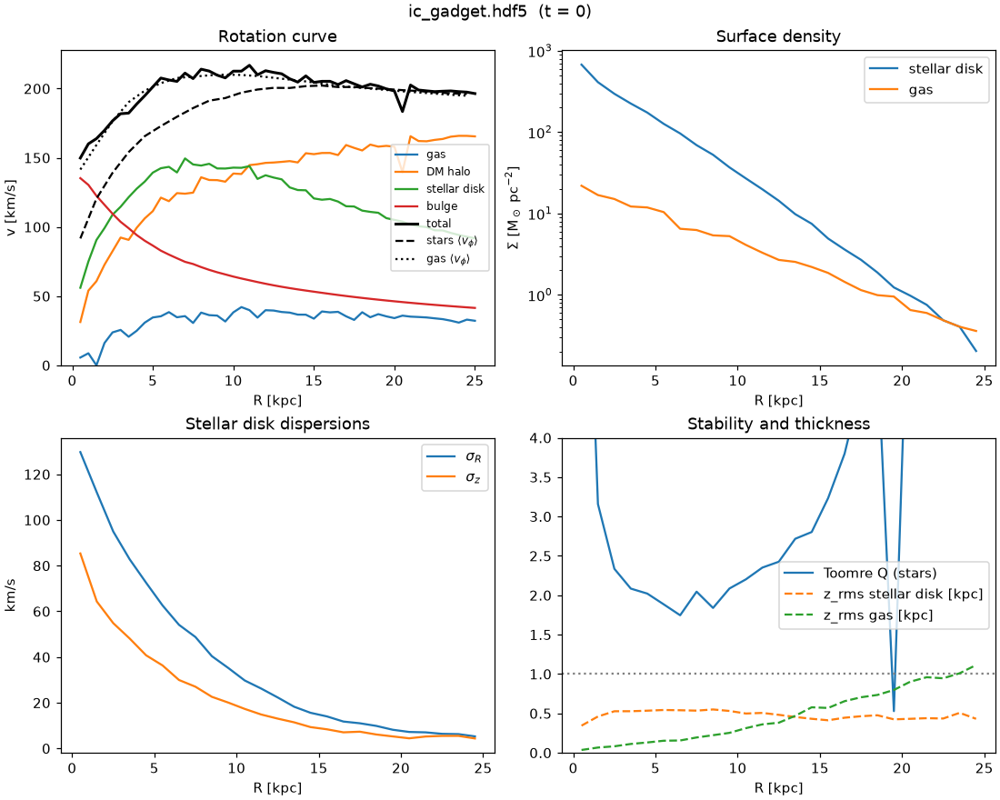

# 02 — Initial conditions with InkWell

We build an isolated Milky Way-like galaxy with four live components:

* a dark-matter (DM) halo;
* a stellar disk;
* a bulge;
* an isothermal gas disk.

[InkWell](../../codes/InkWell) samples the collisionless components from equilibrium distribution
functions computed with Agama. It puts the gas disk in vertical hydrostatic equilibrium and writes a
Gadget4 HDF5 file directly.

Prerequisite: [01 — Environment setup](01_environment_setup.md).

## 1. The model

| Component | Mass [Msun] | Profile | Reference |
|---|---|---|---|
| DM halo | M_vir = 1.0e12 | NFW, c = 10, truncated at r_vir = 212 kpc | Dutton & Macciò (2014) c–M relation |
| Stellar disk | 4.5e10 | exponential, R_d = 3.0 kpc; sech², z0 = 0.3 kpc; Toomre Q = 2 at 2R_d | Bland-Hawthorn & Gerhard (2016) |
| Bulge | 1.0e10 | Hernquist, a = 0.63 kpc | InkWell r_e–M relation |
| Gas disk | 5.0e9 (10% of the disk) | exponential, R_g = 6 kpc; isothermal 10⁴ K; hydrostatic | — |

The **DM halo** has an NFW profile, with a Gaussian taper beyond r_vir. The **bulge** uses the
InkWell r_e–M relation, r_e = 4.16 kpc (M/10¹¹)^0.56. The **gas disk**'s vertical structure comes
from hydrostatic equilibrium.

There is no thick disk, hot gas halo, or stellar halo; InkWell supports all three if you want them later.

### Particle numbers

| | Full run | Test run | Particle mass (full) |
|---|---|---|---|
| DM halo | 6,000,000 | 60,000 | 1.35e5 Msun |
| Stellar disk | 3,000,000 | 30,000 | 1.5e4 Msun |
| Bulge | 666,667 | 6,667 | 1.5e4 Msun |
| Gas | 333,333 | 3,333 | 1.5e4 Msun |
| **Total** | **10,000,000** | **100,000** | |

Why this split:

* **All baryonic particles have the same mass.** Unequal masses exchange energy through two-body
  encounters, which spuriously heats the lighter population.
* **DM particles are 9× heavier than baryons.** This is well below the ~10⁶ Msun at which DM
  particles noticeably heat a thin disk over a few Gyr (Ludlow et al. 2019, MNRAS 488, L123).
* **60% of the particles go to the halo.** This keeps the halo's discreteness noise low in the
  region the disk lives in.

### Two InkWell conventions to know

1. **`omega_b: 0`.** InkWell treats `virial_mass` as the *total* (DM + baryons) mass. It normalises
   the NFW halo to (1 − Ω_b/Ω_m) M_vir. Setting `omega_b: 0` makes `virial_mass` the DM halo mass,
   which is what we want for an isolated galaxy whose baryons are specified explicitly.
2. **The halo is tapered at r_vir.** The density is multiplied by exp(−(r/r_vir)²), so the live
   halo contains ~0.81 M_vir = 8.1e11 Msun. The inner profile is the untruncated NFW.

The first test ICs used Planck's Ω_b = 0.049. With that value the halo held only 6.8e11 Msun and
v_c(8 kpc) was 206 km/s. With `omega_b: 0` it is 214 km/s.

## 2. The configuration files

* `examples/mw_gas/inkwell_mw_gas.yaml` — full resolution (10M particles).
* `examples/mw_gas/inkwell_mw_gas_test.yaml` — test (100k particles), identical otherwise.

Key parts, annotated:

```yaml
dynamics: agama            # DF-based equilibrium; 'jeans' is the legacy (less stable) method
halo:
  type: nfw
  virial_mass: 1.0e+12
  concentration: 10.0
  truncation: 1.0          # taper radius r_t = 1 x r_vir
disks:
  - type: stellar
    mass: 4.5e+10
    scale_length: 3.0      # kpc
    scale_height: 0.3      # kpc
    toomre_q: 2.0          # sets sigma_R; Q ~ 2 keeps the disk bar-stable for Gyrs
  - type: isothermal       # gas disk with fixed temperature
    mass: 5.0e+9
    scale_length: 6.0
    temperature: 1.0e+4    # K
assembly:
  rotation: none           # disk spins counter-clockwise seen from +z
  correct_halo_momentum: true
```

All keys are documented in the InkWell README (`~/codes/InkWell/README.md`, "Configuration reference").

## 3. Generate the ICs

InkWell is serial Python, but Agama uses OpenMP threads, so run it on a full compute node:

```bash
cd examples/mw_gas
# test ICs (100k): ~9 min on the debug partition
sbatch --partition=debug run_ics.sbatch inkwell_mw_gas_test.yaml mw_gas_test
# full ICs (10M)
sbatch run_ics.sbatch inkwell_mw_gas.yaml mw_gas
```

`run_ics.sbatch` runs

```bash
inkwell inkwell_mw_gas.yaml --format gadget4 -o $NBODY_RUNS/ics/mw_gas --seed 42
python check_ics.py $NBODY_RUNS/ics/mw_gas/ic_gadget.hdf5 --plot $NBODY_RUNS/ics/mw_gas/ics_check.png
```

and produces:

```
$NBODY_RUNS/ics/mw_gas/
├── ic_gadget.hdf5      Gadget4 SnapFormat-3 ICs
├── used_params.yaml    the full parameter set InkWell used (provenance)
├── ics_check.png       diagnostic figure from check_ics.py
└── inkwell_mw_gas.yaml copy of the input
```

What to look for in the InkWell log:

* `disc DF calibration 3: Rd(DF)=3.005 vs 3.000 kpc, z_half(R=hd)=330 vs 330 pc`. The disk DF
  reproduces the requested scale length and thickness.
* `Correcting halo bulk momentum`.
* `Done. Total particles: ...` with the expected numbers per component.

### The file

InkWell's units in this file are kpc, km/s, and 1e10 Msun. Gas carries `InternalEnergy` in (km/s)².

| Group | Component | Datasets |
|---|---|---|
| `PartType0` | gas | Coordinates, Velocities, Masses, ParticleIDs, InternalEnergy, Metallicity |
| `PartType1` | DM halo | Coordinates, Velocities, Masses, ParticleIDs |
| `PartType2` | stellar disk | ... + Metallicity, StellarFormationTime (ignored by our Gadget4 build) |
| `PartType3` | bulge | same as PartType2 |

```python
import h5py
f = h5py.File("ic_gadget.hdf5")
print(dict(f["Header"].attrs))           # NumPart_Total = [333333, 6000000, 3000000, 666667, 0, 0]
print(f["PartType0/InternalEnergy"][:5])  # 206.5 (km/s)^2 for 1e4 K
```

> **Isothermal gas caveat.** InkWell writes u = P/((γ−1)ρ) = 1.5 c_s². Our Gadget4 build uses
> `ISOTHERM_EQS`, which reads u as c_s² and uses P = ρu. Without a correction the gas would start
> with 1.5× too much pressure. The Slurm run scripts therefore copy the ICs through
> `fix_isothermal_u.py`, which multiplies u by 2/3 and marks the file so the conversion cannot
> happen twice. If you build Gadget4 with standard adiabatic SPH instead, skip this step.

## 4. Sanity checks (`check_ics.py`)

`check_ics.py` loads any Gadget4 HDF5 file (ICs or snapshot) and performs four checks:

* **Masses and particle numbers** per type.
* **Centre of mass and bulk velocity** of the system.
* **Circular velocity** v_c(R) in the midplane. It is computed from the actual particle
  distribution with a tree code (`pytreegrav`), split by component.
* **Stellar-disk kinematics:** ⟨v_φ⟩, σ_R, σ_z, Toomre Q(R) = σ_R κ / (3.36 G Σ), and the disk
  thickness.

```bash
python check_ics.py $NBODY_RUNS/ics/mw_gas_test/ic_gadget.hdf5 --softening 0.2
```

Results for the test ICs:

```
v_c(R = 8 kpc) = 214.0 km/s;  v_c in 5-20 kpc: 200-217 km/s
PASS: MW-like, roughly flat rotation curve
Stellar disk:  R [kpc]  v_phi  sigma_R  sigma_z   Q
                 3.5   154.1    82.8    48.1   2.08
                 5.5   172.9    62.6    36.3   1.88
                 7.5   185.9    48.8    27.0   2.05
                11.5   199.3    26.2    14.9   2.35
PASS: Toomre Q(2 R_d) = 1.88 (target ~2)
```



How to read the figure:

* **Rotation curve (top left).** The disk dominates inside ~8 kpc and the halo outside. The stars
  lag v_c by ~30 km/s because of asymmetric drift. The gas follows v_c closely because its
  pressure support is small.
* **Surface density (top right).** Both profiles should be straight lines in log-linear: the
  stars with R_d = 3 kpc, the gas with 6 kpc.
* **Dispersions and Q (bottom).** σ_R > σ_z everywhere, and Q stays above 1.5 in the disk
  region. Q ≈ 2 suppresses bar and spiral instabilities over the 2 Gyr we simulate.

If v_c is too low, increase `virial_mass` or `concentration`. If Q < 1.5, increase `toomre_q` or
use `sigma_r0`.

Next: [03 — Running Gadget4](03_running_gadget4.md).
