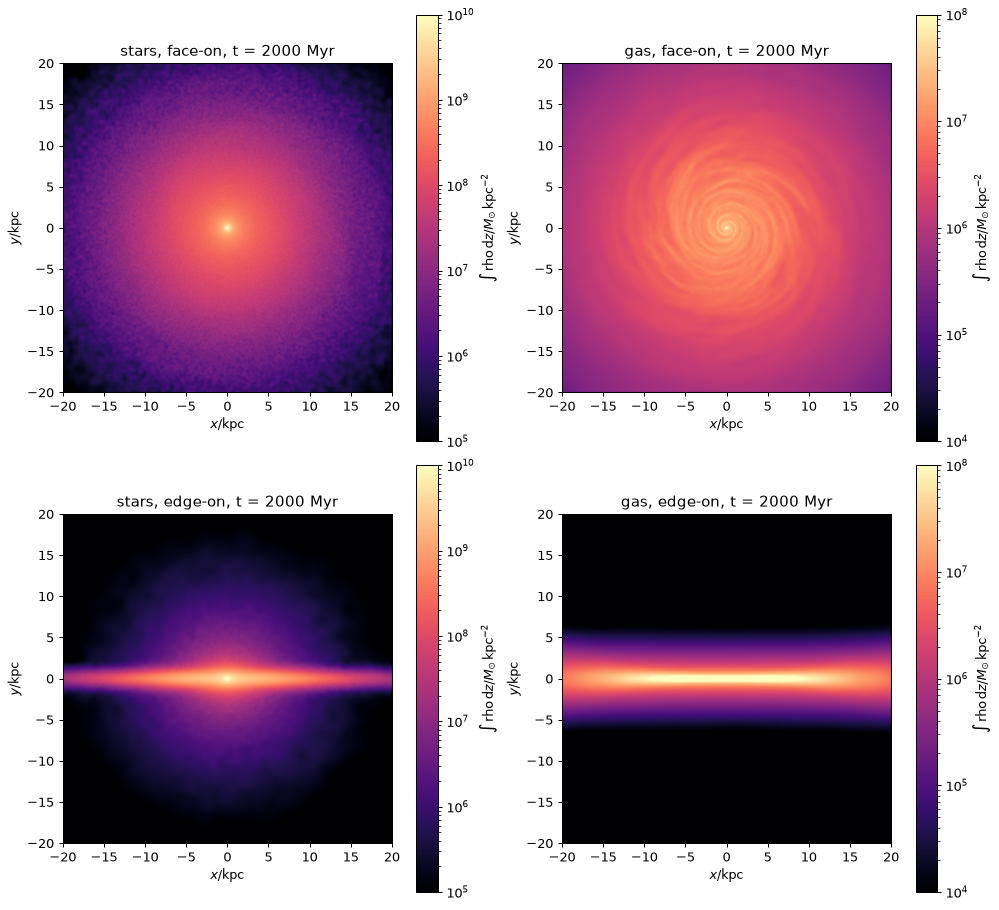
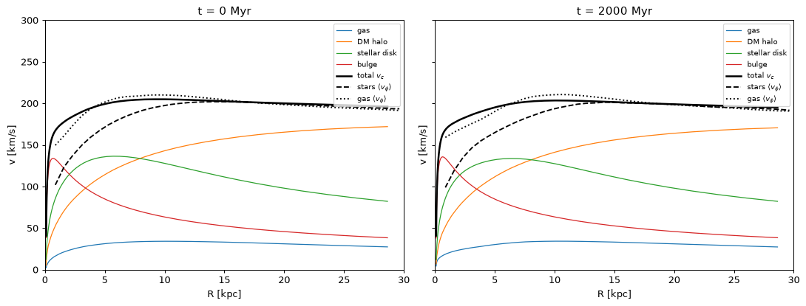
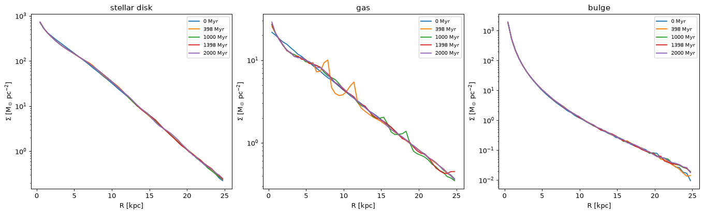

# 04 — Analysis with pynbody

The companion notebook is [`notebooks/mw_gas_analysis.ipynb`](../notebooks/mw_gas_analysis.ipynb).
This page explains the pieces; the notebook puts them together and produces all the figures.

## 0. Start Jupyter on the cluster

Run analysis on a compute node, not the login node:

```bash
cd notebooks
srun -p debug -N1 -n1 -c 16 -t 4:00:00 --pty bash
source ../env/modules.sh
jupyter lab --no-browser --ip=$(hostname) --port=8888
```

Then tunnel from your laptop. Use the node name and token that Jupyter prints:

```bash
ssh -L 8888:geryon3-11:8888 <user>@<geryon3 login>
```

To run the whole notebook non-interactively (for example on the test run):

```bash
cd notebooks
MW_RUN=mw_gas_test jupyter nbconvert --to notebook --execute mw_gas_analysis.ipynb --output mw_gas_test_analysis.ipynb
```

> **Always work from `notebooks/`.** pynbody reads `./config.ini` from the current directory when
> it is imported, and our `config.ini` fixes the particle-type mapping (next section).

## 1. Two pitfalls with Gadget4 HDF5 + pynbody

### Particle families

pynbody groups particles into *families*: `gas`, `dm`, `star`, `bh`. Its default Gadget-HDF mapping
is `dm: PartType1, PartType2, PartType3`. That is a cosmological-simulation convention, and it
would put our stellar disk and bulge into `dm`. `notebooks/config.ini` overrides it:

```ini
[gadgethdf-type-mapping]
gas: PartType0
dm: PartType1
star: PartType2, PartType3, PartType4
bh: PartType5
```

To tell the disk and bulge apart we use particle IDs. InkWell numbers them consecutively in type
order (gas, DM, disk, bulge) starting at 1, and Gadget4 keeps them. `mwtools.load()` adds an array
`s['comp']` with values 0 = gas, 1 = DM, 2 = disk, 3 = bulge.

### Time

For a non-cosmological run (`ComovingIntegrationOn 0`), pynbody still tries to compute an "age of
the universe" from the cosmological parameters. The parameters are all zero here, so it gets the
nonsense value ~9.8 Gyr. The real time is `Header/Time` in code units of 0.9778 Gyr, and
`mwtools.load()` sets it.

You will also see `UserWarning: Unable to infer units from HDF attributes`. This is harmless:
pynbody then reads the units from the snapshot's `Parameters` group. The masses and lengths it
reports are correct.

## 2. Loading and selecting

```python
import pynbody, mwtools
s = mwtools.load(mwtools.snapshots("mw_gas")[-1])   # physical units, centred, face-on
s.g, s.dm, s.s                                     # gas, dark matter, stars (disk + bulge)
disk  = s.s[s.s["comp"] == 2]
bulge = s.s[s.s["comp"] == 3]
inner = s[pynbody.filt.Sphere("10 kpc")]           # filters return sub-snapshots
thin  = disk[pynbody.filt.BandPass("z", "-0.5 kpc", "0.5 kpc")]
s.loadable_keys()                                  # ['pos', 'vel', 'mass', 'iord', 'phi', 'eps']
```

Arrays are loaded lazily. Derived arrays such as `r`, `rxy`, `vphi`, `vr`, `vz`, and `j` are
computed on demand. Centring and alignment come from `pynbody.analysis.faceon(s)` (or `sideon`).
It centres on the stars with a shrinking sphere, subtracts their bulk velocity, and rotates the
stars' angular momentum onto +z. `mwtools.load()` calls it unless `center=False`.

## 3. The plots

| Plot | pynbody tool | Notes |
|---|---|---|
| Face-on and edge-on maps | `pynbody.plot.sph.image(fam, qty="rho", units="Msol kpc^-2", width=40, axes=ax)` | Projected surface density. Stars get SPH smoothing lengths from a KD-tree (slow for millions of particles; computed once). |
| Rotation curve | `Profile(sub, type="log", ndim=3)["mass_enc"]` → v_c = sqrt(GM(<r)/r) per component; `Profile(..., ndim=2)["vphi"]` | Stellar ⟨v_φ⟩ lags v_c by asymmetric drift. Gas follows v_c. |
| Surface-density profiles | `Profile(sub, ndim=2)["density"]` | With `ndim=2`, density is per unit area. Fit log Σ vs R for R_d. |
| Gas and stellar mass vs time | `output/energy.txt` (last `NTYPES` columns), cross-checked with snapshot sums | Every 5 Myr instead of every snapshot. |
| Disk stability | A₂ = \|Σ m e^{2iφ}\| / Σ m in R < 6 kpc; z_rms at 7–9 kpc | A₂ > 0.2 means a bar. Growing z_rms means heating. |

### Why the masses are constant

This run has isothermal gas without cooling or star formation, so gas and stellar masses must stay
exactly constant. The mass-versus-time plot then checks mass conservation and the snapshot
bookkeeping (gas → star conversion would show up here). With `COOLING` + `STARFORMATION`, new stars
appear as PartType4. The `star` family in `config.ini` already includes PartType4, so the same
notebook would show gas consumption and stellar mass growth.

## 4. Results

### Test run (100k particles, 500 Myr)

* Total energy drift 1.8×10⁻⁴; gas and stellar mass changes are exactly 0.
* Rotation curve: total v_c ≈ 205 km/s at 8 kpc and flat to 30 kpc, unchanged after 500 Myr.
  Gas ⟨v_φ⟩ follows v_c; stars lag by ~25 km/s at 5 kpc.
* No bar: A₂ ≤ 0.05.
* The stellar R_d grows from 3.0 to 3.4 kpc, and the disk thickens ~12% at 8 kpc. Both come from
  the deliberately coarse resolution (1.1e7 Msun DM particles, 0.23 kpc softening).

### Full run (10M particles, 2 Gyr)

The notebook on the full run takes ~2.5 min on a 32-core debug node.

* **Conservation.** Energy drift is 4.9×10⁻⁴ over 2 Gyr, and gas and stellar masses are exactly
  constant, as they must be without star formation.
* **No bar and no heating.** A₂ ≤ 0.007 at all times. The stellar z_rms at 7–9 kpc grows only
  1.3% in 2 Gyr, compared with +12% in 500 Myr in the test run. The test's thickening was
  therefore resolution, as expected.
* **Initial relaxation, then steady.** During the first 200 Myr a little mass moves outward:
  inner stellar Σ (2–4 kpc) drops ~9%, Σ at 7–9 kpc rises ~7%, and the fitted R_d grows from
  3.26 to 3.44 kpc. The gas disk settles from 0.216 to 0.201 kpc in z_rms. From 0.2 to 2 Gyr
  all of these are constant to within ~1%.
* **Gas structure.** The cold isothermal gas develops flocculent, tightly wound multi-arm
  spirals. Σ_gas(R) shows transient ring-like bumps (8 and 11 kpc at ~0.4 Gyr) that dissolve
  by 1 Gyr.
* **Rotation curve.** Unchanged between 0 and 2 Gyr. The gas ⟨v_φ⟩ follows v_c, and the stars
  lag inside ~10 kpc.





The disk-only fit in the notebook gives R_d ≈ 3.3 kpc already at t = 0 for InkWell's 3.0 kpc
disk; the fit range and the binning differ from InkWell's calibration. Compare times, not the
absolute value.
